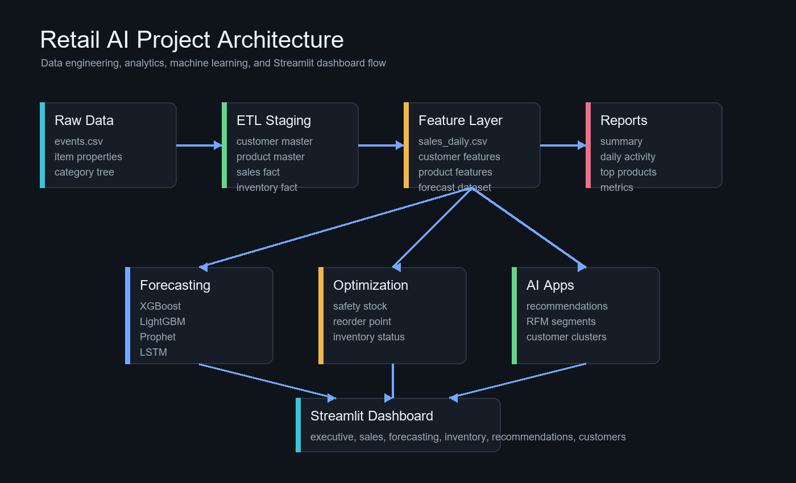

# Retail AI Intelligence Platform

End-to-end retail analytics and machine learning platform for sales intelligence, demand forecasting, inventory risk, product recommendations, and customer segmentation.

[](https://www.python.org/)
[](https://streamlit.io/)
[](https://www.microsoft.com/sql-server)
[](#machine-learning)

> This is an educational and portfolio project. It uses the Retailrocket e-commerce events dataset together with generated business attributes such as prices, quantities, customer profiles, and inventory levels. Its outputs should not be used for operational purchasing or financial decisions.

## Live application

[Open the Retail AI Streamlit dashboard](https://retail-ai-project.streamlit.app/)

The multi-page application provides:

- Executive KPIs and business activity trends
- Daily revenue, orders, quantity, and profit analysis
- Product-level and total-demand forecasting views
- Inventory health and reorder-risk monitoring
- Item-to-item product recommendations
- RFM customer analysis and business segments

## Why this project exists

Retail data is often distributed across behavioral events, transactions, product records, and inventory systems. This project demonstrates how those sources can be transformed into a compact analytical platform covering the full workflow:

1. Download and validate raw interaction data.
2. Build warehouse-style staging tables.
3. Engineer analytics and forecasting features.
4. Train and evaluate multiple demand models.
5. Calculate inventory risk and reorder signals.
6. Build implicit-feedback recommendations.
7. Segment customers using RFM and clustering.
8. Publish results through Streamlit and SQL Server assets.

## Architecture

```text
Retailrocket events
        |
        v
ETL and staging tables
        |
        v
Processed feature layer
        |
        +----------------+----------------+----------------+
        |                |                |                |
        v                v                v                v
   Forecasting      Inventory       Recommendations   Customer analytics
        |                |                |                |
        +----------------+----------------+----------------+
                                 |
                                 v
                    Reports and model artifacts
                                 |
                     +-----------+-----------+
                     |                       |
                     v                       v
             Streamlit dashboard      SQL Server layer
```



## Technology stack

| Area | Technologies |
|---|---|
| Data processing | Python, pandas, NumPy |
| Forecasting | XGBoost, LightGBM, Prophet, TensorFlow/Keras LSTM |
| Recommendations | Implicit interaction scoring, cosine similarity, scikit-learn |
| Customer analytics | RFM analysis, KMeans, scikit-learn |
| Visualization | Streamlit, Plotly |
| Database | SQL Server schema, indexes, constraints, `BULK INSERT` |
| Artifact management | CSV reports, Joblib, Keras model files, JSON metadata |

## Repository structure

```text
Retail_AI_Project/
|-- customer_analytics/    # RFM scoring and customer segmentation
|-- data/
|   |-- raw/               # Source data (not committed)
|   |-- staging/           # Warehouse-style ETL outputs (not committed)
|   `-- processed/         # Engineered features and dashboard aggregates
|-- database/              # SQL Server schema and export generator
|-- etl/                   # Raw-to-staging transformations
|-- forecasting/           # Forecast dataset and model training scripts
|-- inventory/             # Safety stock and reorder-risk calculations
|-- models/                # Model metadata and local model artifacts
|-- recommendation/        # Item similarity and recommendation generation
|-- reports/               # Metrics, feature importance, and summaries
|-- sql/                   # Generated SQL Server deployment scripts
|-- src/                   # Shared paths, I/O helpers, and feature jobs
|-- streamlit_app/         # Multi-page analytics application
|-- pipeline_config.py     # Ordered pipeline stage definitions
`-- run_pipeline.py        # Integrated pipeline runner
```

## Data

The raw source is the [Retailrocket recommender-system dataset](https://www.kaggle.com/datasets/retailrocket/ecommerce-dataset). The downloader expects these files:

```text
data/raw/events.csv
data/raw/item_properties_part1.csv
data/raw/item_properties_part2.csv
data/raw/category_tree.csv
```

Download them with:

```powershell
python etl\download_dataset.py
```

### Data-generation disclosure

The Retailrocket data supplies visitor, item, event, and timestamp information. The ETL layer generates additional fields for demonstration, including:

- Customer gender, income group, and initial segment
- Product brand, unit price, cost price, and margin
- Transaction quantity
- Warehouse assignment
- Current stock, safety stock, reorder point, and lead time

These generated values make the warehouse and dashboard complete, but they are not observed commercial facts.

## Getting started

### Prerequisites

- Python 3.12 recommended
- Git
- Enough memory for the recommendation matrix and deep-learning stages
- SQL Server only if you want to deploy the database layer

### Installation

```powershell
git clone https://github.com/srijabiswas-01/Retail_AI_Project.git
cd Retail_AI_Project
python -m venv .venv
.\.venv\Scripts\Activate.ps1
python -m pip install --upgrade pip
pip install -r requirements.txt
```

The root requirements file supports the complete analytics and modeling workflow. Streamlit Community Cloud uses the smaller `streamlit_app/requirements.txt`, which contains only dashboard runtime dependencies.

## Running the project

### Streamlit dashboard

```powershell
streamlit run streamlit_app\Home.py
```

Then open `http://localhost:8501`.

### Integrated pipeline

Run every configured stage:

```powershell
python run_pipeline.py
```

Run a faster pass that skips the LSTM and similarity-matrix build. The recommendation post-processing step still requires an existing `recommendation/item_similarity.csv`; omit the `recommendation` stage when that artifact is unavailable:

```powershell
python run_pipeline.py --skip-heavy
```

Run selected stages:

```powershell
python run_pipeline.py --stages etl features inventory customer database
```

Available stages are `etl`, `features`, `forecasting`, `inventory`, `recommendation`, `customer`, and `database`. See [docs_pipeline.md](docs_pipeline.md) for the concise pipeline guide.

## Analytics modules

### Sales intelligence

Transaction events are enriched with generated product and quantity data, then aggregated into daily revenue, order, quantity, cost, and profit measures.

### Demand forecasting

The product-level dataset covers the 250 highest-volume products and creates a continuous daily panel. Features include calendar attributes, lags of 1, 7, and 30 days, and shifted rolling averages. The tree models use chronological training and holdout periods.

Prophet and LSTM operate on total daily demand, while XGBoost and LightGBM operate on product-day quantity. Their absolute metric values are therefore not directly comparable.

### Inventory optimization

Historical daily demand is combined with lead time and stock information to calculate:

```text
safety stock = service-level factor * demand standard deviation * sqrt(lead time)

reorder point = average demand * lead time + safety stock
```

Records are classified as `Safe`, `Low Stock`, or `Critical`.

### Recommendations

Customer behavior is converted into implicit scores:

| Event | Score |
|---|---:|
| View | 1 |
| Add to cart | 3 |
| Transaction | 5 |

Cosine similarity between product interaction vectors produces the top ten related items for each selected product.

### Customer analytics

Customers receive recency, frequency, and monetary scores and are clustered with KMeans. Business rules assign interpretable labels:

- VIP Customer
- Loyal Customer
- High Value Customer
- Recent Customer
- At Risk Customer
- Regular Customer

## Machine learning

### Current validation snapshot

| Model | Forecast scope | MAE | RMSE | R2 |
|---|---|---:|---:|---:|
| LightGBM | Product-day quantity | 0.340 | 0.828 | 0.038 |
| XGBoost | Product-day quantity | 0.410 | 0.905 | -0.148 |
| LSTM | Total daily quantity | 98.409 | 129.305 | -0.085 |
| Prophet | Total daily quantity | 106.407 | 146.433 | -0.435 |

LightGBM performs best on the current product-level holdout, but the near-zero R2 indicates limited predictive power. The models are experimental baselines rather than production forecasting systems.

### Generated output snapshot

| Dataset | Rows |
|---|---:|
| Forecast dataset | 27,250 |
| Inventory optimization | 235,061 |
| Top recommendations | 29,980 |
| Customer segments | 11,719 |

Model definitions, targets, artifact paths, and recorded metrics are documented in [`models/model_metadata.json`](models/model_metadata.json).

## SQL Server layer

The database layer contains dimensional and fact-table definitions for:

- `dbo.dim_customer`
- `dbo.dim_product`
- `dbo.fact_sales`
- `dbo.fact_inventory`

Generate the deployment scripts with:

```powershell
python database\export_sql_server_scripts.py --sample-inserts 5
```

Run the resulting files in this order:

1. `sql/00_create_retail_ai_schema.sql`
2. `sql/01_load_retail_ai_data.sql`
3. `sql/02_validate_retail_ai_data.sql`

`01_load_retail_ai_data.sql` uses SQL Server `BULK INSERT`. Update the CSV paths and ensure that the SQL Server service account can read them.

## Deployment

For Streamlit Community Cloud:

1. Select `streamlit_app/Home.py` as the entrypoint.
2. Select Python 3.12 in Advanced settings.
3. Deploy from the `main` branch.
4. Keep model training and heavy pipeline execution outside Streamlit.

The repository includes the compact datasets required by the dashboard. Raw data, trained model binaries, and the large item-similarity matrix remain excluded from Git.

## Limitations and responsible use

- Several commercial attributes are generated rather than observed.
- Sparse product demand makes product-level forecasting difficult.
- Current forecasting R2 values do not support production use.
- Inventory formulas are analytical demonstrations and omit supplier, service-level, and cost constraints needed in a real system.
- Recommendations are based on co-interaction similarity and have not been evaluated through online experiments.
- The committed inventory dataset is relatively large for free Streamlit hosting and may increase cold-start time.

## Troubleshooting

### A dashboard dataset is missing

Run the relevant pipeline stage and confirm that its generated CSV is committed when required by the deployed application.

### Streamlit shows old data

Reboot the application after pushing data changes. Locally, stop Streamlit, start it again, and hard-refresh the browser.

### Streamlit dependency installation fails

Confirm that `streamlit_app/requirements.txt` contains only dashboard dependencies and deploy with Python 3.12. Training libraries belong in the root requirements file.

### SQL Server cannot load CSV files

Verify the absolute paths in the generated load script and grant read permission to the SQL Server service account.

## GitHub About

Suggested repository description:

> End-to-end retail analytics and ML platform with Streamlit dashboards, demand forecasting, inventory optimization, recommendations, RFM segmentation, ETL, and SQL Server assets.

Suggested topics:

```text
retail-analytics
machine-learning
streamlit
demand-forecasting
inventory-optimization
recommendation-system
customer-segmentation
rfm-analysis
xgboost
lightgbm
prophet
lstm
data-engineering
etl-pipeline
sql-server
business-intelligence
python
```

## Future improvements

- Replace generated commercial fields with real catalog, pricing, and stock data.
- Add backtesting across multiple rolling forecast windows.
- Add model and recommendation quality monitoring.
- Pre-aggregate the inventory dataset for faster cloud rendering.
- Introduce automated tests and continuous integration.
- Store large artifacts in object storage or an artifact registry.
- Add data-quality checks at every pipeline boundary.

## Acknowledgements

- [Retailrocket recommender-system dataset](https://www.kaggle.com/datasets/retailrocket/ecommerce-dataset)
- Open-source Python, Streamlit, Plotly, scikit-learn, XGBoost, LightGBM, Prophet, and TensorFlow communities
